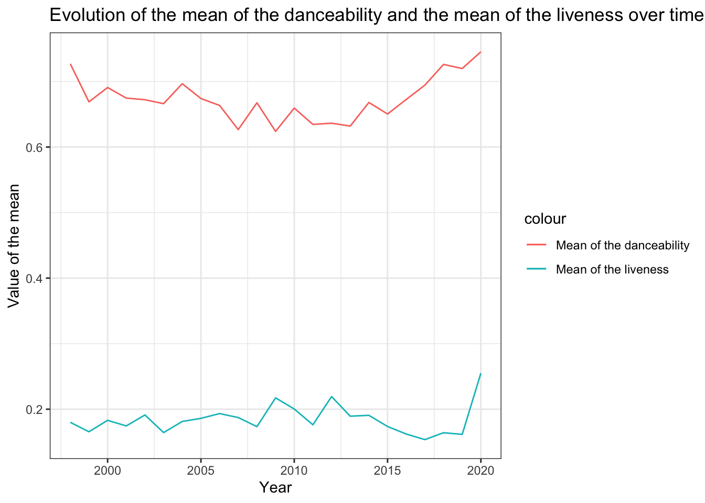

::: {.cell}

```{.r .cell-code}
here::i_am("Lab 5.Rproj")
```

::: {.cell-output .cell-output-stderr}
```
here() starts at /Users/jeanbaptisteastruc/Desktop/QE/Data Management and Programming/Lecture-TD 5/Lab 5
```
:::

```{.r .cell-code}
library(here)
library(dplyr)
```

::: {.cell-output .cell-output-stderr}
```

Attaching package: 'dplyr'
```
:::

::: {.cell-output .cell-output-stderr}
```
The following objects are masked from 'package:stats':

    filter, lag
```
:::

::: {.cell-output .cell-output-stderr}
```
The following objects are masked from 'package:base':

    intersect, setdiff, setequal, union
```
:::

```{.r .cell-code}
library(ggplot2)
library(tidyr)
theme_set(theme_bw())
```
:::


## Exercise 1


::: {.cell}

```{.r .cell-code}
spotify <- readRDS(here("top-spotify-hits-2000-2019.Rds"))
```
:::


### Question 1


::: {.cell}

```{.r .cell-code}
spotify_songs <- spotify |> 
  distinct(artist, song, .keep_all = TRUE)

nbsongs <- nrow(spotify_songs)
```
:::


The data set contains 1926 songs.


::: {.cell}

```{.r .cell-code}
spotify_artists <- spotify |>
  distinct(artist)

nbartists <- nrow(spotify_artists)
```
:::


The data set contains 835 artists.


::: {.cell}

```{.r .cell-code}
spotify_genre <- spotify |>
  distinct(genre)

nbgenre <- nrow(spotify_genre)
```
:::


The data set contains 59 genres.

### Question 2


::: {.cell}

```{.r .cell-code}
artists_by_year <- spotify |>
  group_by(year) |>
  distinct(artist)|>
  summarise(nbartists_by_year = n())

table1 <- knitr::kable(artists_by_year, col.names = c("Year", "Number of distinct artists per year"))
```
:::


Here is the table: 


| Year| Number of distinct artists per year|
|----:|-----------------------------------:|
| 1998|                                   1|
| 1999|                                  30|
| 2000|                                  58|
| 2001|                                  77|
| 2002|                                  56|
| 2003|                                  64|
| 2004|                                  65|
| 2005|                                  69|
| 2006|                                  63|
| 2007|                                  66|
| 2008|                                  63|
| 2009|                                  61|
| 2010|                                  62|
| 2011|                                  69|
| 2012|                                  67|
| 2013|                                  64|
| 2014|                                  70|
| 2015|                                  69|
| 2016|                                  75|
| 2017|                                  86|
| 2018|                                  81|
| 2019|                                  73|
| 2020|                                   3|


### Question 3


::: {.cell}

```{.r .cell-code}
most_pop_artist_table <- spotify_songs |>
  group_by(artist) |>
  distinct(song) |>
  summarise(nbsongs_by_year = n()) |>
  arrange(desc(nbsongs_by_year)) |>
  slice_head(n = 1)

most_pop_artist_name <- most_pop_artist_table |>
  pull(artist)

most_pop_artist_nbsongs <- most_pop_artist_table |>
  pull(nbsongs_by_year)
```
:::


The most popular artist is Rihanna with 23 songs.

### Question 4


::: {.cell}

```{.r .cell-code}
tempo_genre <- spotify_songs |>
  group_by(genre) |>
  distinct(tempo, song, .keep_all = TRUE) |>
  summarise(min(tempo), max(tempo), mean(tempo), median(tempo), n())

table2 <- knitr::kable(tempo_genre)
```
:::


Here is the table:


|genre                                 | min(tempo)| max(tempo)| mean(tempo)| median(tempo)| n()|
|:-------------------------------------|----------:|----------:|-----------:|-------------:|---:|
|Dance/Electronic                      |     75.255|    179.642|    125.5075|      126.0410|  41|
|Folk/Acoustic, pop                    |     94.931|    128.945|    111.9380|      111.9380|   2|
|Folk/Acoustic, rock                   |     84.192|     84.192|     84.1920|       84.1920|   1|
|Folk/Acoustic, rock, pop              |    138.585|    138.585|    138.5850|      138.5850|   1|
|R&B                                   |     71.815|    170.661|    106.9248|      100.4600|  13|
|World/Traditional, Folk/Acoustic      |     82.803|     82.803|     82.8030|       82.8030|   1|
|World/Traditional, hip hop            |     98.077|    101.993|    100.0350|      100.0350|   2|
|World/Traditional, pop                |    108.102|    108.102|    108.1020|      108.1020|   1|
|World/Traditional, pop, Folk/Acoustic |    100.380|    104.833|    102.6065|      102.6065|   2|
|World/Traditional, rock               |     96.000|    140.083|    118.0415|      118.0415|   2|
|World/Traditional, rock, pop          |    132.013|    139.048|    135.5305|      135.5305|   2|
|country                               |    103.055|    205.570|    138.1508|      136.0020|   9|
|country, latin                        |     96.055|     96.055|     96.0550|       96.0550|   1|
|easy listening                        |    157.920|    157.920|    157.9200|      157.9200|   1|
|hip hop                               |     64.934|    179.974|    116.9894|      111.6795| 120|
|hip hop, Dance/Electronic             |     95.948|    190.151|    135.4297|      131.0500|  15|
|hip hop, R&B                          |    100.215|    151.181|    121.1220|      111.9700|   3|
|hip hop, country                      |     97.984|     97.984|     97.9840|       97.9840|   1|
|hip hop, latin, Dance/Electronic      |    171.993|    171.993|    171.9930|      171.9930|   1|
|hip hop, pop                          |     73.003|    203.911|    118.9619|      119.9750| 265|
|hip hop, pop, Dance/Electronic        |     72.022|    196.093|    120.8555|      126.0620|  75|
|hip hop, pop, R&B                     |     60.019|    203.862|    115.1808|      107.2030| 234|
|hip hop, pop, R&B, Dance/Electronic   |     82.820|    127.901|    103.9113|      101.0130|   3|
|hip hop, pop, R&B, latin              |     82.331|    100.010|     91.1705|       91.1705|   2|
|hip hop, pop, country                 |    129.370|    129.370|    129.3700|      129.3700|   1|
|hip hop, pop, latin                   |     89.661|    180.184|    127.2119|      127.0265|  14|
|hip hop, pop, rock                    |     84.858|    179.999|    123.1123|      125.2500|   9|
|hip hop, rock, pop                    |     90.052|     90.052|     90.0520|       90.0520|   1|
|latin                                 |     90.013|    198.075|    121.6049|       97.0620|  15|
|metal                                 |     79.012|    147.387|    106.2089|      101.9680|   9|
|pop                                   |     65.043|    195.685|    120.6325|      119.9520| 411|
|pop, Dance/Electronic                 |     84.878|    198.065|    123.7314|      124.0800| 213|
|pop, Folk/Acoustic                    |     76.026|    171.790|    118.3595|      109.9505|   8|
|pop, R&B                              |     68.942|    210.851|    117.0158|      111.9645| 170|
|pop, R&B, Dance/Electronic            |     84.021|    176.051|    112.0338|      104.0865|   6|
|pop, R&B, easy listening              |    108.984|    108.984|    108.9840|      108.9840|   1|
|pop, country                          |     97.865|    147.905|    130.5087|      136.9250|   8|
|pop, easy listening, Dance/Electronic |    135.099|    135.099|    135.0990|      135.0990|   1|
|pop, easy listening, jazz             |     82.168|    127.831|    104.9995|      104.9995|   2|
|pop, latin                            |     79.997|    177.833|    113.5903|      104.2540|  28|
|pop, rock                             |     77.967|    176.667|    121.0976|      119.0095|  26|
|pop, rock, Dance/Electronic           |     87.016|    189.857|    133.9808|      135.9875|  12|
|pop, rock, Folk/Acoustic              |    102.961|    112.960|    107.9605|      107.9605|   2|
|pop, rock, metal                      |     82.952|    155.827|    128.9358|      134.7165|  14|
|rock                                  |     74.989|    199.935|    129.5312|      123.6960|  57|
|rock, Dance/Electronic                |    127.988|    127.988|    127.9880|      127.9880|   1|
|rock, Folk/Acoustic, easy listening   |    122.979|    122.979|    122.9790|      122.9790|   1|
|rock, Folk/Acoustic, pop              |     80.529|     80.529|     80.5290|       80.5290|   1|
|rock, R&B, Folk/Acoustic, pop         |    105.987|    105.987|    105.9870|      105.9870|   1|
|rock, blues                           |    123.904|    141.933|    132.9185|      132.9185|   2|
|rock, blues, latin                    |     97.911|    127.981|    112.9460|      112.9460|   2|
|rock, classical                       |     81.663|     81.663|     81.6630|       81.6630|   1|
|rock, easy listening                  |    114.999|    114.999|    114.9990|      114.9990|   1|
|rock, metal                           |     89.342|    187.961|    127.3922|      120.0555|  36|
|rock, pop                             |     68.976|    184.086|    123.8996|      124.9700|  39|
|rock, pop, Dance/Electronic           |    113.049|    181.994|    135.7678|      127.4480|   8|
|rock, pop, metal                      |    126.115|    152.034|    140.2785|      141.4825|   4|
|rock, pop, metal, Dance/Electronic    |    105.013|    105.013|    105.0130|      105.0130|   1|
|set()                                 |     68.507|    184.819|    120.1329|      126.9620|  22|


### Question 5


::: {.cell}

```{.r .cell-code}
liveness_danceability <- spotify_songs |>
  group_by(year) |>
  distinct(liveness, danceability, .keep_all = TRUE) |>
  summarise(mean_liveness = mean(liveness), 
            mean_danceability = mean(danceability))
```
:::


### Question 6


::: {.cell}

```{.r .cell-code}
ggplot(liveness_danceability, aes(x = year)) +
  geom_line(aes(y = mean_liveness, color = "Mean of the liveness")) +
  geom_line(aes(y = mean_danceability, color = "Mean of the danceability")) +
  xlab("Year") +
  ylab("Value of the mean") +
  ggtitle("Evolution of the mean of the danceability and the mean of the liveness over time")
```

::: {.cell-output-display}
{width=672}
:::
:::


## Exercise 2


::: {.cell}

```{.r .cell-code}
dropout <- readRDS(here("dropout.RDS"))
```
:::


### Question 1


::: {.cell}

```{.r .cell-code}
median_admission_grade <- dropout |>
  group_by(Target, `Marital status`) |>
  summarise(median_ad = median(`Admission grade`), .groups = "drop_last")
```
:::


### Question 2


::: {.cell}

```{.r .cell-code}
median_admission_grade_2 <- dropout |>
  group_by(Target, `Marital status`) |>
  summarise(median_ad = median(`Admission grade`), .groups = "drop_last") |>
  pivot_wider(values_from = median_ad, names_from = Target)

table3 <- knitr::kable(median_admission_grade_2)
```
:::


Here is the table:


|Marital status    | Dropout| Graduate| Enrolled|
|:-----------------|-------:|--------:|--------:|
|single            |  123.35|    127.3|   124.05|
|married           |  126.50|    130.0|   122.95|
|divorced          |  126.50|    126.0|   130.20|
|widower           |  129.40|    170.0|   151.75|
|facto union       |  119.40|    120.0|   119.70|
|legally separated |  112.50|    114.8|   119.00|


### Question 3


::: {.cell}

```{.r .cell-code}
curricular_units <- names(select(dropout, starts_with("Curricular units")))

median_curricular_units <- dropout |>
  group_by(Gender) |>
  summarize(across(all_of(curricular_units), ~median(., na.rm = TRUE)), .groups = 'drop')
```
:::


### Question 4


::: {.cell}

```{.r .cell-code}
step1 <- dropout |>
  select(starts_with("Curricular units"), Gender) |>
  pivot_longer(cols = starts_with("Curricular units"),
                names_to = "Units",
                values_to = "Value")

final_table <- step1 |> 
  group_by(Units, Gender) |>
  summarize(Median_Value = median(Value, na.rm = TRUE), .groups = 'drop') |>
  pivot_wider(names_from = Gender,
              values_from = Median_Value)

table4 <- knitr::kable(final_table)
```
:::


Here is the table:


|Units                                          |     Male| Female|
|:----------------------------------------------|--------:|------:|
|Curricular units 1st sem (approved)            |  4.00000|    6.0|
|Curricular units 1st sem (credited)            |  0.00000|    0.0|
|Curricular units 1st sem (enrolled)            |  6.00000|    6.0|
|Curricular units 1st sem (evaluations)         |  8.00000|    8.0|
|Curricular units 1st sem (grade)               | 11.83333|   12.5|
|Curricular units 1st sem (without evaluations) |  0.00000|    0.0|
|Curricular units 2nd sem (approved)            |  4.00000|    5.0|
|Curricular units 2nd sem (credited)            |  0.00000|    0.0|
|Curricular units 2nd sem (enrolled)            |  6.00000|    6.0|
|Curricular units 2nd sem (evaluations)         |  8.00000|    8.0|
|Curricular units 2nd sem (grade)               | 11.63604|   12.5|
|Curricular units 2nd sem (without evaluations) |  0.00000|    0.0|


