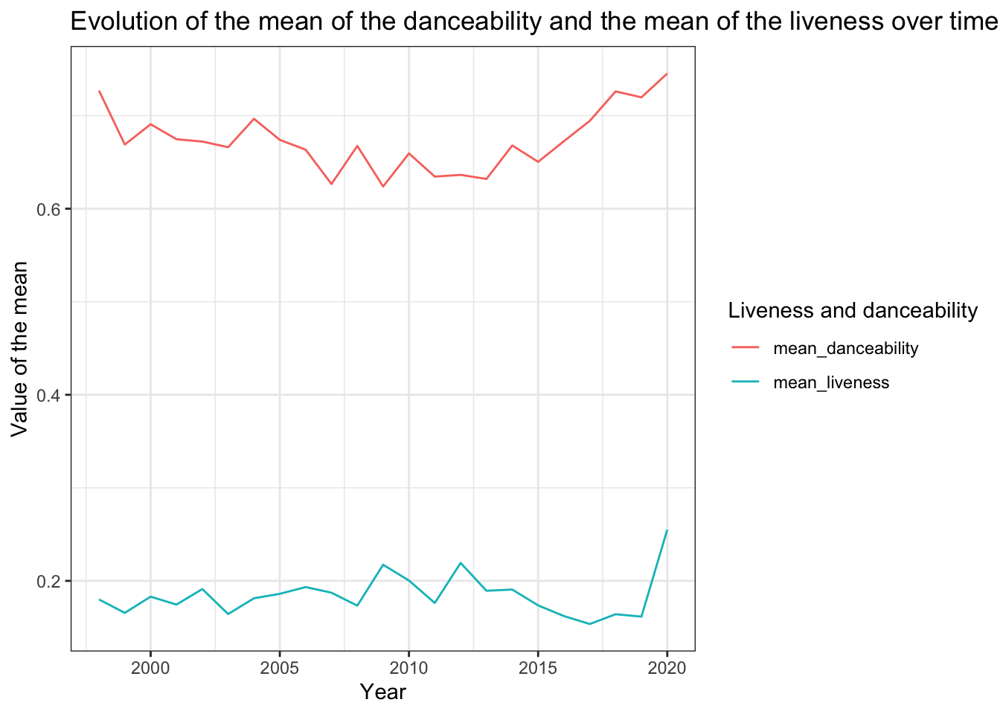

## Exercise 1

::: {.cell}

:::

### Question 1

::: {.cell}

:::

The data set contains 1926 songs.

::: {.cell}

:::

The data set contains 835 artists.

::: {.cell}

:::

The data set contains 59 genres.

### Question 2

::: {.cell}

:::

Here is the table: 

| Year| Number of distinct artists per year|
|----:|-----------------------------------:|
| 1998|                                   1|
| 1999|                                  30|
| 2000|                                  58|
| 2001|                                  77|
| 2002|                                  56|
| 2003|                                  64|
| 2004|                                  65|
| 2005|                                  69|
| 2006|                                  63|
| 2007|                                  66|
| 2008|                                  63|
| 2009|                                  61|
| 2010|                                  62|
| 2011|                                  69|
| 2012|                                  67|
| 2013|                                  64|
| 2014|                                  70|
| 2015|                                  69|
| 2016|                                  75|
| 2017|                                  86|
| 2018|                                  81|
| 2019|                                  73|
| 2020|                                   3|

### Question 3

::: {.cell}

:::

The most popular artist is Rihanna with 23 songs.

### Question 4

::: {.cell}

:::

Here is the table:

|genre                                 | min(tempo)| max(tempo)| mean(tempo)| median(tempo)| n()|
|:-------------------------------------|----------:|----------:|-----------:|-------------:|---:|
|Dance/Electronic                      |     75.255|    179.642|    125.5075|      126.0410|  41|
|Folk/Acoustic, pop                    |     94.931|    128.945|    111.9380|      111.9380|   2|
|Folk/Acoustic, rock                   |     84.192|     84.192|     84.1920|       84.1920|   1|
|Folk/Acoustic, rock, pop              |    138.585|    138.585|    138.5850|      138.5850|   1|
|R&B                                   |     71.815|    170.661|    106.9248|      100.4600|  13|
|World/Traditional, Folk/Acoustic      |     82.803|     82.803|     82.8030|       82.8030|   1|
|World/Traditional, hip hop            |     98.077|    101.993|    100.0350|      100.0350|   2|
|World/Traditional, pop                |    108.102|    108.102|    108.1020|      108.1020|   1|
|World/Traditional, pop, Folk/Acoustic |    100.380|    104.833|    102.6065|      102.6065|   2|
|World/Traditional, rock               |     96.000|    140.083|    118.0415|      118.0415|   2|
|World/Traditional, rock, pop          |    132.013|    139.048|    135.5305|      135.5305|   2|
|country                               |    103.055|    205.570|    138.1508|      136.0020|   9|
|country, latin                        |     96.055|     96.055|     96.0550|       96.0550|   1|
|easy listening                        |    157.920|    157.920|    157.9200|      157.9200|   1|
|hip hop                               |     64.934|    179.974|    116.9894|      111.6795| 120|
|hip hop, Dance/Electronic             |     95.948|    190.151|    135.4297|      131.0500|  15|
|hip hop, R&B                          |    100.215|    151.181|    121.1220|      111.9700|   3|
|hip hop, country                      |     97.984|     97.984|     97.9840|       97.9840|   1|
|hip hop, latin, Dance/Electronic      |    171.993|    171.993|    171.9930|      171.9930|   1|
|hip hop, pop                          |     73.003|    203.911|    118.9619|      119.9750| 265|
|hip hop, pop, Dance/Electronic        |     72.022|    196.093|    120.8555|      126.0620|  75|
|hip hop, pop, R&B                     |     60.019|    203.862|    115.1808|      107.2030| 234|
|hip hop, pop, R&B, Dance/Electronic   |     82.820|    127.901|    103.9113|      101.0130|   3|
|hip hop, pop, R&B, latin              |     82.331|    100.010|     91.1705|       91.1705|   2|
|hip hop, pop, country                 |    129.370|    129.370|    129.3700|      129.3700|   1|
|hip hop, pop, latin                   |     89.661|    180.184|    127.2119|      127.0265|  14|
|hip hop, pop, rock                    |     84.858|    179.999|    123.1123|      125.2500|   9|
|hip hop, rock, pop                    |     90.052|     90.052|     90.0520|       90.0520|   1|
|latin                                 |     90.013|    198.075|    121.6049|       97.0620|  15|
|metal                                 |     79.012|    147.387|    106.2089|      101.9680|   9|
|pop                                   |     65.043|    195.685|    120.6325|      119.9520| 411|
|pop, Dance/Electronic                 |     84.878|    198.065|    123.7314|      124.0800| 213|
|pop, Folk/Acoustic                    |     76.026|    171.790|    118.3595|      109.9505|   8|
|pop, R&B                              |     68.942|    210.851|    117.0158|      111.9645| 170|
|pop, R&B, Dance/Electronic            |     84.021|    176.051|    112.0338|      104.0865|   6|
|pop, R&B, easy listening              |    108.984|    108.984|    108.9840|      108.9840|   1|
|pop, country                          |     97.865|    147.905|    130.5087|      136.9250|   8|
|pop, easy listening, Dance/Electronic |    135.099|    135.099|    135.0990|      135.0990|   1|
|pop, easy listening, jazz             |     82.168|    127.831|    104.9995|      104.9995|   2|
|pop, latin                            |     79.997|    177.833|    113.5903|      104.2540|  28|
|pop, rock                             |     77.967|    176.667|    121.0976|      119.0095|  26|
|pop, rock, Dance/Electronic           |     87.016|    189.857|    133.9808|      135.9875|  12|
|pop, rock, Folk/Acoustic              |    102.961|    112.960|    107.9605|      107.9605|   2|
|pop, rock, metal                      |     82.952|    155.827|    128.9358|      134.7165|  14|
|rock                                  |     74.989|    199.935|    129.5312|      123.6960|  57|
|rock, Dance/Electronic                |    127.988|    127.988|    127.9880|      127.9880|   1|
|rock, Folk/Acoustic, easy listening   |    122.979|    122.979|    122.9790|      122.9790|   1|
|rock, Folk/Acoustic, pop              |     80.529|     80.529|     80.5290|       80.5290|   1|
|rock, R&B, Folk/Acoustic, pop         |    105.987|    105.987|    105.9870|      105.9870|   1|
|rock, blues                           |    123.904|    141.933|    132.9185|      132.9185|   2|
|rock, blues, latin                    |     97.911|    127.981|    112.9460|      112.9460|   2|
|rock, classical                       |     81.663|     81.663|     81.6630|       81.6630|   1|
|rock, easy listening                  |    114.999|    114.999|    114.9990|      114.9990|   1|
|rock, metal                           |     89.342|    187.961|    127.3922|      120.0555|  36|
|rock, pop                             |     68.976|    184.086|    123.8996|      124.9700|  39|
|rock, pop, Dance/Electronic           |    113.049|    181.994|    135.7678|      127.4480|   8|
|rock, pop, metal                      |    126.115|    152.034|    140.2785|      141.4825|   4|
|rock, pop, metal, Dance/Electronic    |    105.013|    105.013|    105.0130|      105.0130|   1|
|set()                                 |     68.507|    184.819|    120.1329|      126.9620|  22|

### Question 5

::: {.cell}

:::

Here is the table:

| year| mean_liveness| mean_danceability|
|----:|-------------:|-----------------:|
| 1998|     0.1800000|         0.7270000|
| 1999|     0.1656000|         0.6689737|
| 2000|     0.1830141|         0.6908169|
| 2001|     0.1745019|         0.6746981|
| 2002|     0.1911812|         0.6722000|
| 2003|     0.1643511|         0.6661556|
| 2004|     0.1812862|         0.6966383|
| 2005|     0.1860881|         0.6740198|
| 2006|     0.1933129|         0.6634624|
| 2007|     0.1872922|         0.6265889|
| 2008|     0.1733648|         0.6675055|
| 2009|     0.2173341|         0.6239146|
| 2010|     0.2003471|         0.6594412|
| 2011|     0.1762427|         0.6345312|
| 2012|     0.2192598|         0.6363839|
| 2013|     0.1893674|         0.6320000|
| 2014|     0.1906531|         0.6679898|
| 2015|     0.1736300|         0.6503889|
| 2016|     0.1621426|         0.6726064|
| 2017|     0.1536101|         0.6944404|
| 2018|     0.1641243|         0.7260971|
| 2019|     0.1615809|         0.7197640|
| 2020|     0.2550000|         0.7453333|

### Question 6

::: {.cell}
::: {.cell-output-display}
{width=672}
:::
:::

## Exercise 2

::: {.cell}

:::

### Question 1

::: {.cell}

:::

### Question 2

::: {.cell}

:::

Here is the table:

|Marital status    | Dropout| Graduate| Enrolled|
|:-----------------|-------:|--------:|--------:|
|single            |  123.35|    127.3|   124.05|
|married           |  126.50|    130.0|   122.95|
|divorced          |  126.50|    126.0|   130.20|
|widower           |  129.40|    170.0|   151.75|
|facto union       |  119.40|    120.0|   119.70|
|legally separated |  112.50|    114.8|   119.00|

### Question 3

::: {.cell}

:::

### Question 4

::: {.cell}

:::

Here is the table:

|Units                                          |     Male| Female|
|:----------------------------------------------|--------:|------:|
|Curricular units 1st sem (approved)            |  4.00000|    6.0|
|Curricular units 1st sem (credited)            |  0.00000|    0.0|
|Curricular units 1st sem (enrolled)            |  6.00000|    6.0|
|Curricular units 1st sem (evaluations)         |  8.00000|    8.0|
|Curricular units 1st sem (grade)               | 11.83333|   12.5|
|Curricular units 1st sem (without evaluations) |  0.00000|    0.0|
|Curricular units 2nd sem (approved)            |  4.00000|    5.0|
|Curricular units 2nd sem (credited)            |  0.00000|    0.0|
|Curricular units 2nd sem (enrolled)            |  6.00000|    6.0|
|Curricular units 2nd sem (evaluations)         |  8.00000|    8.0|
|Curricular units 2nd sem (grade)               | 11.63604|   12.5|
|Curricular units 2nd sem (without evaluations) |  0.00000|    0.0|

